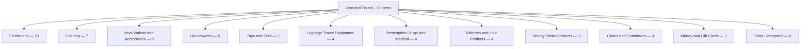
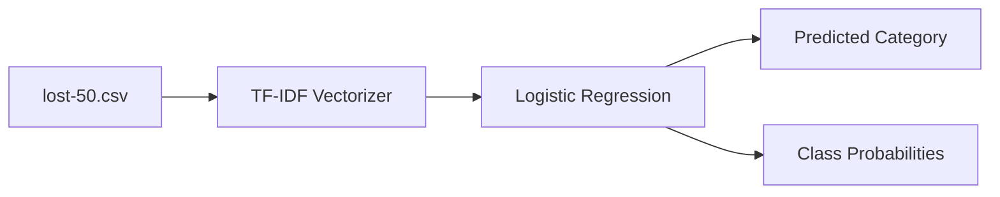
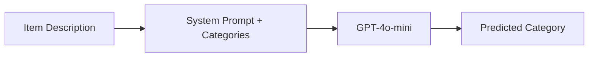
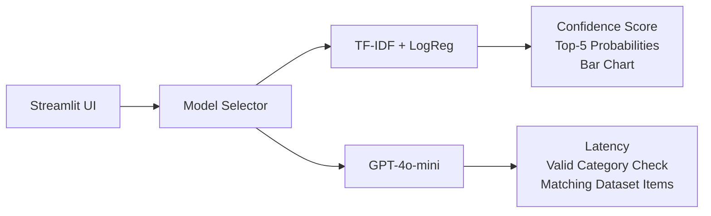

# Lost & Found — Lab Readme

**Source:** `lost-50.csv`  
**Total Items:** 70  
**Total Categories:** 17  
**Date:** April 7, 2026

---

## Project Structure

```
/
├── lost-50.csv                      # cleaned dataset
├── classifier.py                    # TF-IDF + Logistic Regression
├── classifier_llm.py                # GPT-4o-mini (OpenAI API)
├── app.py                           # Streamlit UI
├── .env                             # OPENAI_API_KEY (not committed)
├── .env.example                     # template for collaborators
├── .gitignore                       # excludes .env, __pycache__, .DS_Store
├── models/
│   ├── tfidf_logreg.joblib          # saved sklearn pipeline
│   └── llm_classifier_config.json  # saved LLM categories + prompt
├── .venv/
│   └── env.sample                   # venv-scoped env template
└── lab-readme.md
```


---

## Category Counts

| Count | Category |
|------:|----------|
| 20 | Electronics |
| 7 | Clothing |
| 6 | Keys, Wallets and Other Personal Accessories |
| 5 | Housewares |
| 5 | Toys and Pets |
| 4 | Luggage, Travel Equipment |
| 4 | Prescription Drugs and Medical Equipment |
| 4 | Toiletries and Hair Products |
| 3 | Disney Parks Products |
| 3 | Cases and Containers |
| 3 | Money and Gift Cards |
| 1 | Eyewear |
| 1 | Footwear |
| 1 | IDs, Drivers Licenses, Credit Cards and Passports |
| 1 | Baby or Child Item |
| 1 | Jewelry |
| 1 | Bottles, Cups and Mugs |



---

## Classifiers

### Model 1 — TF-IDF + Logistic Regression (`classifier.py`)

Traditional ML pipeline trained on the dataset.

| Setting | Value |
|---------|-------|
| Vectorizer | TF-IDF, unigrams + bigrams, log-scaled TF |
| Model | Logistic Regression, `class_weight=balanced` |
| Cross-validation | 5-fold accuracy: **49% ± 13%** |
| Test split accuracy | **50%** (14 items) |
| Saved model | `models/tfidf_logreg.joblib` |

> Low accuracy is expected — 70 items across 17 categories means some classes have only 1 training example.



**Run:**
```bash
python3 classifier.py
```

---

### Model 2 — GPT-4o-mini LLM (`classifier_llm.py`)

Zero-shot classification using OpenAI API. All 17 categories are injected into the system prompt so the model can only return a valid label.

| Setting | Value |
|---------|-------|
| Model | `gpt-4o-mini` |
| Temperature | 0 (deterministic) |
| Strategy | Zero-shot with constrained category list |
| API key | loaded from `.env` → `OPENAI_API_KEY` |
| Saved config | `models/llm_classifier_config.json` |



**Run interactive:**
```bash
python3 classifier_llm.py
```

**Run evaluation against full dataset:**
```bash
python3 classifier_llm.py --evaluate
```

---

## Streamlit App (`app.py`)

Interactive UI to classify free-text item descriptions using either model.



**Launch:**
```bash
streamlit run app.py
```

App runs at: http://localhost:8501

---

## Load Saved Model for Testing

```python
import joblib
pipeline = joblib.load("models/tfidf_logreg.joblib")
pipeline.predict(["black leather wallet"])
# → ['Keys, Wallets and Other Personal Accessories']
```

---

## Setup & Installation

```bash
# Clone the repo
git clone https://github.com/iportilla/4210-wk12.git
cd 4210-wk12

# Create and activate virtual environment
python3 -m venv .venv
source .venv/bin/activate

# Install dependencies
pip install pandas scikit-learn joblib openai python-dotenv streamlit

# Add your OpenAI key
cp .env.example .env
# edit .env and set OPENAI_API_KEY=sk-...
```

## 
